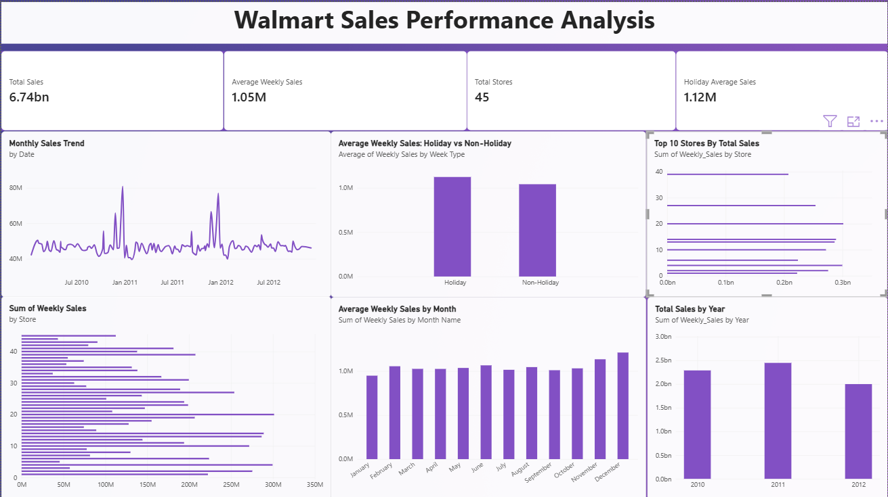
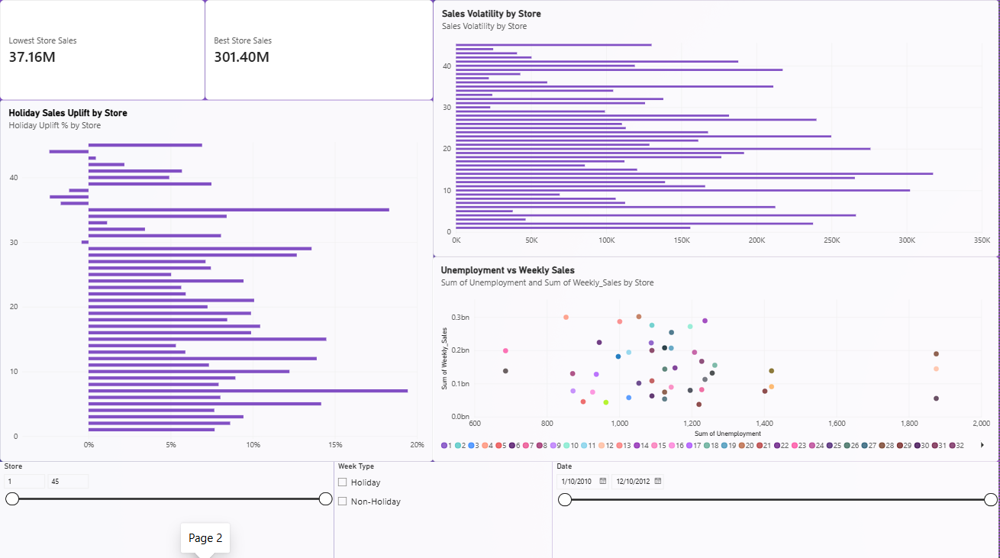

# Walmart Sales Performance Analysis

## 📌 Project Overview

This project analyzes Walmart's historical weekly sales data to identify sales trends, store-level performance, seasonal patterns, holiday impact, sales volatility, and relationships between weekly sales and external factors.

The project uses **SQL, Python, and Power BI** to perform data analysis and transform the findings into meaningful business insights and recommendations.

---

## 🎯 Business Problem

The objective of this project is to understand Walmart's sales performance across different stores and time periods and identify factors that can help improve business decision-making.

The analysis focuses on:

- How sales change over time
- Yearly and monthly sales trends
- Store-level sales performance
- Holiday vs non-holiday sales
- Store-level holiday sales uplift
- Sales volatility across stores
- Relationship between sales and external factors
- Identification of unusually high sales periods

---

## 📂 Dataset

The dataset contains **6,435 weekly sales records** across **45 stores**.

### Columns

| Column | Description |
|---|---|
| `Store` | Store identification number |
| `Date` | Weekly sales date |
| `Weekly_Sales` | Sales recorded for the week |
| `Holiday_Flag` | Indicates whether the week was a holiday |
| `Temperature` | Temperature during the week |
| `Fuel_Price` | Fuel price during the week |
| `CPI` | Consumer Price Index |
| `Unemployment` | Unemployment rate |

The dataset was checked for missing values and duplicate records during the data preparation process.

---

## 🛠️ Tools & Technologies

- **MySQL** – Data analysis and business queries
- **Python** – Exploratory Data Analysis
- **Pandas** – Data manipulation and analysis
- **Matplotlib** – Data visualization
- **Power BI** – Interactive dashboard and visualization
- **GitHub** – Project documentation and version control

---

## 🧹 Data Preparation

The dataset was examined before analysis to ensure data quality.

The following checks were performed:

- Checked for missing values
- Checked for duplicate records
- Verified data types
- Converted date values into a suitable date format
- Examined numerical columns for unusual values
- Checked sales values for negative values
- Reviewed temperature values for unusual observations
- Identified potential sales outliers using the IQR method

---

## 🔍 SQL Analysis

SQL was used to perform exploratory analysis and answer key business questions.

The analysis included:

- Total and average weekly sales
- Minimum and maximum sales
- Yearly sales performance
- Monthly sales performance
- Store-level sales analysis
- Holiday vs non-holiday sales
- Top-performing stores
- Low-performing stores
- Sales trends over time

SQL was also used to calculate business metrics that were later used in the Power BI dashboard.

---

## 🐍 Python EDA

Python was used to perform exploratory data analysis using **Pandas and Matplotlib**.

The analysis included:

- Sales distribution
- Monthly sales trends
- Yearly sales trends
- Store-level performance
- Holiday vs non-holiday sales
- Correlation analysis
- Sales volatility
- Outlier detection

### Python Visualizations

The generated charts are stored in the `images` folder.

---

## 📊 Power BI Dashboard

An interactive Power BI dashboard was created to visualize the key findings.

### Dashboard Overview



### Store & Business Analysis



### Dashboard Features

- Total Sales
- Average Weekly Sales
- Total Stores
- Holiday Average Sales
- Monthly Sales Trends
- Store Performance
- Holiday Sales Analysis
- Sales Volatility
- Holiday Sales Uplift
- Unemployment vs Weekly Sales
- Interactive Store, Date, and Week Type slicers

The slicers are synchronized across dashboard pages to allow interactive analysis.

---

## 💡 Key Insights

### 1. 2011 was the strongest sales year

Total sales increased from approximately **$2.29B in 2010 to $2.45B in 2011**, making 2011 the strongest full year in the dataset.

> Note: 2012 contains partial-year data and should not be directly compared with the full years.

### 2. Sales show strong year-end seasonality

December recorded the highest average weekly sales at approximately **$1.21M**, followed by November at approximately **$1.13M**.

January recorded the lowest average weekly sales at approximately **$948K**.

### 3. Holiday weeks generate higher sales

Average weekly sales were approximately **$1.12M during holiday weeks**, compared with **$1.04M during non-holiday weeks**.

This represents approximately **7.8% higher average sales during holiday weeks**.

### 4. Store performance varies significantly

Store 20 recorded the highest total sales at approximately **$301.4M** and the highest average weekly sales at approximately **$2.11M**.

Store 33 had the lowest average weekly sales at approximately **$260K**.

### 5. Holiday impact differs across stores

Store 7 recorded the highest holiday sales uplift at approximately **19.44%**, while Store 44 experienced approximately **2.38% lower sales during holiday weeks**.

### 6. Sales volatility varies across stores

Store 14 had the highest weekly sales volatility, while Store 37 had the lowest.

This indicates that some stores experience considerably larger fluctuations in weekly sales than others.

### 7. External factors show limited relationship with sales

Temperature, fuel price, CPI, and unemployment showed weak correlations with weekly sales.

The correlation values ranged from approximately **-0.106 to 0.009**, indicating that these factors alone do not strongly explain weekly sales variation in this dataset.

### 8. A small number of weeks recorded unusually high sales

The IQR method identified **34 unusually high weekly sales records** above the calculated upper threshold of approximately **$2.72M**.

These observations were treated as potential peak-demand periods rather than automatically being removed.

---

## 📈 Business Recommendations

### 1. Prepare for year-end demand

Increase inventory, staffing, and logistics capacity before November and December due to stronger seasonal demand.

### 2. Use store-specific strategies

Different stores show significantly different sales performance. Inventory and promotional strategies should therefore be adapted to individual store characteristics.

### 3. Optimize holiday campaigns

Stores with strong holiday responses should receive greater attention during holiday periods, while stores with weak or negative uplift should be investigated to understand the reasons behind their performance.

### 4. Improve demand planning for volatile stores

Stores with high sales volatility may require closer monitoring of inventory and demand patterns to reduce stock-related issues.

### 5. Investigate peak-sales periods

The unusually high sales observations should be investigated to determine whether they are associated with holidays, promotions, or other demand-driving events.

### 6. Combine multiple factors for decision-making

Since the analyzed external factors showed weak relationships with sales, they should be combined with store-level, seasonal, promotional, and historical sales information rather than being used independently.

---

## 📁 Project Structure

```text
Walmart-Sales-Performance-Analysis/
│
├── data/
│   └── Walmart_Sales_Cleaned.csv
│
├── python/
│   └── walmart_sales_eda.py
│
├── sql/
│   └── Walmart.sql
│
├── powerbi/
│   └── walmart_sales_project.pbix
│
├── images/
│   ├── Python EDA charts
│   └── Visualizations
│
└── README.md
